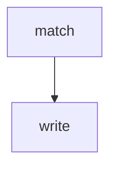

# geographie-daten

Anreicherung der Orte aus der HisMusLog-Datenbank mit der GND-Kennung aus den
Geografikum Entitäten der GND ([DNB OpenData](https://data.dnb.de/opendata/)).

## Setup

```
python3 -m venv venv
venv/bin/pip install -r requirements.txt
```

## CLI

### Usage Example

```
python geographiedaten.py \
  --places: data/kv-ort-eigeneorte.csv \
  --geografikum: data/authorities-geografikum_lds.jsonld.gz \
  --output: output.csv
```

-> python command_line match places geografikum output e.g.: 

```
python command_line.py match "../data/places_from_db.csv" "../data/example.jsonld" "../data/example_to_put_in_db.csv" 
python command_line.py write "db-linux-002.aesthetics.mpg.de" "hismuslog" '../data/records_to_put_in_db(new).csv'
```


